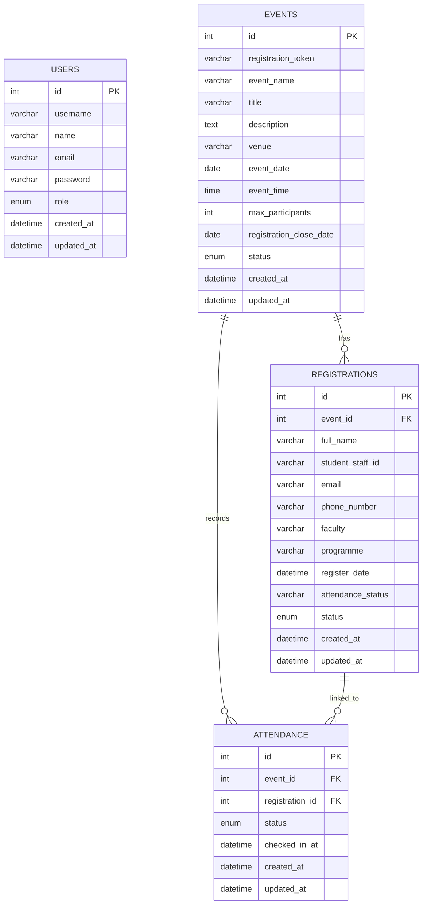

# Library Event Registration System (LERS)

## IMS566 - Advanced Web Design Development and Content Management

LERS is a web-based system for managing library events and participant registration. It converts a manual event registration process into an online application with authentication, CRUD, search/filter, attendance tracking, and PDF export.

## Live System

Application URL:

`https://ptarapps.uitm.edu.my/ims566_group/`

GitHub Repository Link:

`Add the final GitHub repository URL here before submission.`

## Technology Stack

| Item | Technology |
| --- | --- |
| Framework | CodeIgniter 4 |
| Language | PHP 8.1+ |
| Database | MySQL |
| Frontend | Bootstrap 5 |
| PDF Export | DomPDF |
| Browser Target | Google Chrome |

## User Roles

| Role | Access |
| --- | --- |
| Superadmin | Dashboard, user management, event management, participant management, attendance, PDF export |
| Admin | Dashboard, event management, participant management, attendance, PDF export |
| Public participant | Event registration form through public event URL |

## Main Features

* Login and logout
* Role-based admin access
* Event create, list, update, delete
* Generated public registration URL for each event
* Public participant registration form
* Participant list, update, delete
* Attendance mark as Present or Absent
* Search and filter for events, activities, and attendance lists
* Attendance report export to PDF
* Responsive Bootstrap navigation and UI

## CRUD Workflow

1. Admin creates an event.
2. System generates a registration token and public registration URL.
3. Participant submits the registration form.
4. Admin reviews participant list by event.
5. Admin edits participant details or deletes invalid records.
6. Admin marks participant attendance as Present or Absent.
7. Admin exports attendance list to PDF.

## Entity Relationship Diagram

## Database Tables

* `users` - administrator accounts and roles
* `events` - event details and registration token
* `registrations` - participant registration and status
* `attendance` - optional attendance record linkage

The database setup script is available at `database/lers_schema.sql`.

## System Requirements

* PHP 8.1 or newer
* Composer
* MySQL or MariaDB
* Apache/Nginx with rewrite support
* Google Chrome for testing and presentation

## Support Contact

Add the project manager or team support contact before final submission.
